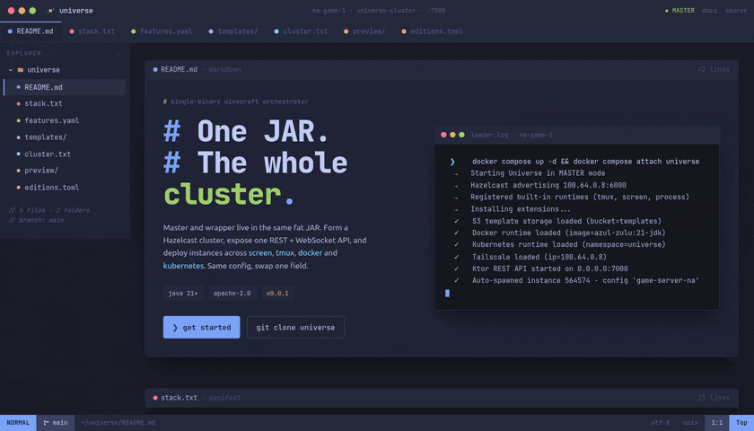
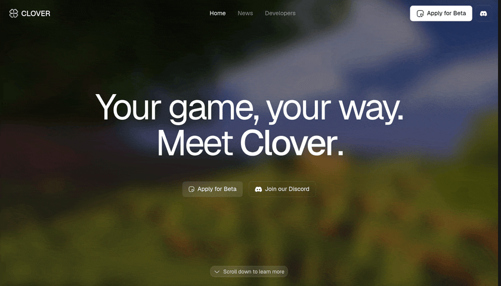
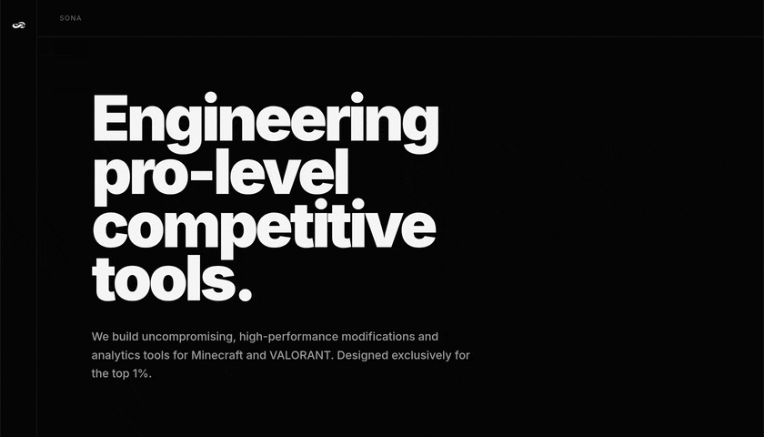
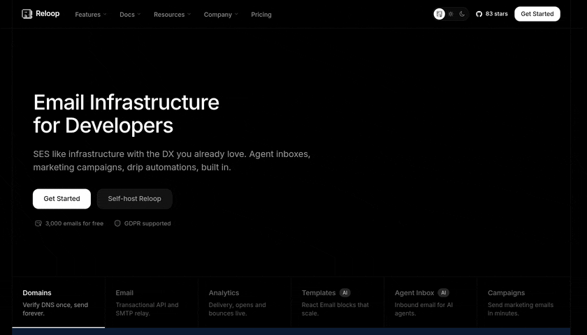
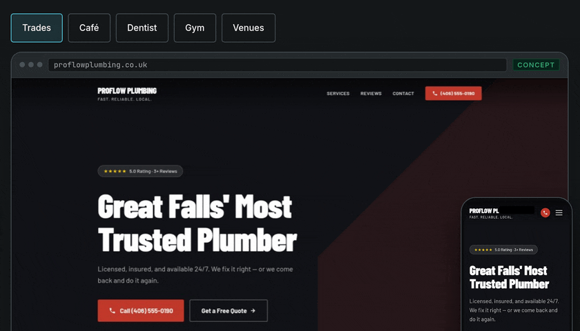
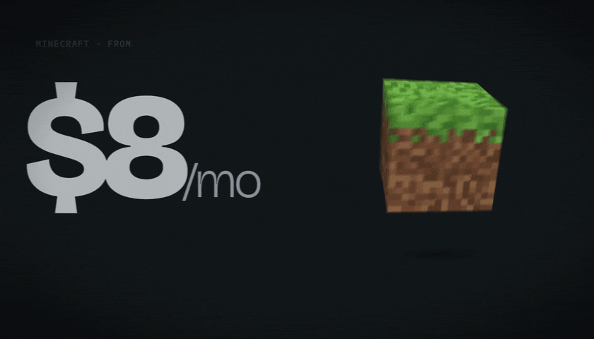
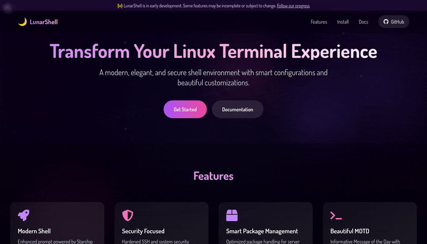
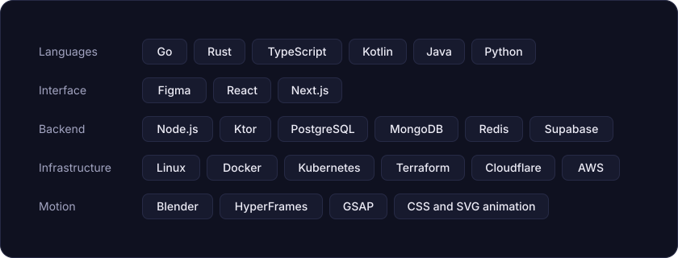

<picture>
  <source media="(max-width: 600px)" srcset="assets/hero-mobile.svg">
  
</picture>

### About me

Trans girl, lifelong IT obsessive, and space nerd. I have been in Minecraft since it launched and turned it into a career, building server infrastructure since the early 2020s. My background is Linux infrastructure, distributed systems, and DevOps, and I design and animate the interfaces that sit on top of it. Right now I'm COO at Sona Interactive, the studio behind Clover Client, where I also own the backend and REST API.

### What I do

<picture>
  <source media="(max-width: 600px)" srcset="assets/disciplines-mobile.svg">
  
</picture>

### Selected work

<table>
<tr>
<td>

<b>Universe</b> Author, open source under Apache-2.0

Single-JAR game server orchestrator and my flagship open-source project. Designed pluggable runtimes deploying identical config to screen, tmux, Docker, or Kubernetes via self-registering extensions.

<a href="https://universe.lunarlabs.dev">universe.lunarlabs.dev</a> &nbsp;&nbsp; <a href="https://github.com/universeclouddev/Universe">Source on GitHub</a>

</td>
</tr>
</table>

<table>
<tr>
<td width="50%" valign="top">

<b>Clover Client</b> Software engineer since Feb 2026

Own the backend and REST API for a cross-platform Minecraft client (Windows, macOS, Linux) through private beta launch.

<a href="https://cloverclient.com">cloverclient.com</a>

</td>
<td width="50%" valign="top">

<b>Sona Interactive</b> COO since Aug 2026

The studio behind Clover Client. Promoted to COO after six months; set engineering direction, run release and bug-triage processes, and align technical priorities with the beta roadmap.

<a href="https://sona.gg">sona.gg</a>

</td>
</tr>
</table>

<table>
<tr>
<td width="50%" valign="top">

<b>Reloop</b> Software engineer, backend, since Aug 2026

Open-source transactional email platform, multi-tenant and built around low send latency.

<a href="https://reloop.sh">reloop.sh</a> &nbsp;&nbsp; <a href="https://github.com/reloop-labs/reloop">Source on GitHub</a>

</td>
<td width="50%" valign="top">

<b>LunarLabs and Scala Studios</b> Founder and COO since 2023

Web development and infrastructure management for small businesses. LunarLabs owns Scala Studios, its Minecraft engineering division.

<a href="https://lunarlabs.dev">lunarlabs.dev</a> &nbsp;&nbsp; <a href="https://scala.gg">scala.gg</a> &nbsp;&nbsp; <a href="https://github.com/scalagg">Scala Studios on GitHub</a>

</td>
</tr>
</table>

<table>
<tr>
<td width="50%" valign="top">

<b>Darkless</b> Director and lead DevOps since 2024

Cloud and bare metal services, plus hosting for bots and Minecraft servers.

<a href="https://darkless.cloud">darkless.cloud</a>

</td>
<td width="50%" valign="top">

<b>LunarShell</b> Author, open source

Security-focused shell. Built a distributable shell environment for Linux servers: Starship prompt, system-metrics MOTD, and hardened SSH defaults.

<a href="https://www.lunarshell.dev">lunarshell.dev</a> &nbsp;&nbsp; <a href="https://github.com/ohemilyy/LunarShell">Source on GitHub</a>

</td>
</tr>
</table>

### Experience

<picture>
  <source media="(max-width: 600px)" srcset="assets/experience-mobile.svg">
  
</picture>

### Stack

<picture>
  <source media="(max-width: 600px)" srcset="assets/stack-mobile.svg">
  
</picture>

### Contact

[Portfolio and email](https://pawful.dev/#contact) &nbsp;&nbsp; [Discord](https://discord.com/users/1057312650381504543) &nbsp;&nbsp; [LunarLabs](https://lunarlabs.dev) &nbsp;&nbsp; [Resume (PDF)](https://pawful.dev/resume.pdf)
